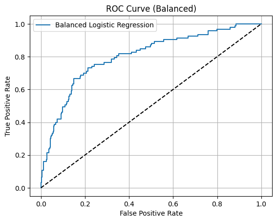

# Logistic Regression on Churn Dataset

This project was completed as part of my Machine Learning Internship at Codveda Technologies.

## ✅ Objective

Use logistic regression to predict customer churn and analyze key behavioral signals.

## 📊 Dataset

Used `churn-bigml-80.csv` and `churn-bigml-20.csv` (public telecom churn dataset).

## 📈 Steps

- Cleaned and merged datasets
- One-hot encoded categorical features
- Normalized numeric features
- Applied class balancing to address label imbalance
- Tuned classification threshold to optimize recall
- Interpreted model coefficients via odds ratios

## 🧠 Key Insights

- **Customer service calls** and **international plans** significantly increase churn odds
- **Voice mail plans** decrease churn risk

## 🔍 Final Model Metrics (Threshold = 0.3)

| Metric     | Value    |
|------------|----------|
| Accuracy   | 59.1%    |
| Precision  | 23.0%    |
| Recall     | 84.0%    |
| ROC AUC    | 0.80     |

## 📊 ROC Curve and Threshold Tuning

.png)

## 🛠️ Tools Used

- Python, pandas, scikit-learn, matplotlib

## 🚀 Project Outcome

This task demonstrates the practical use of logistic regression in real-world classification scenarios involving class imbalance and feature interpretation.
